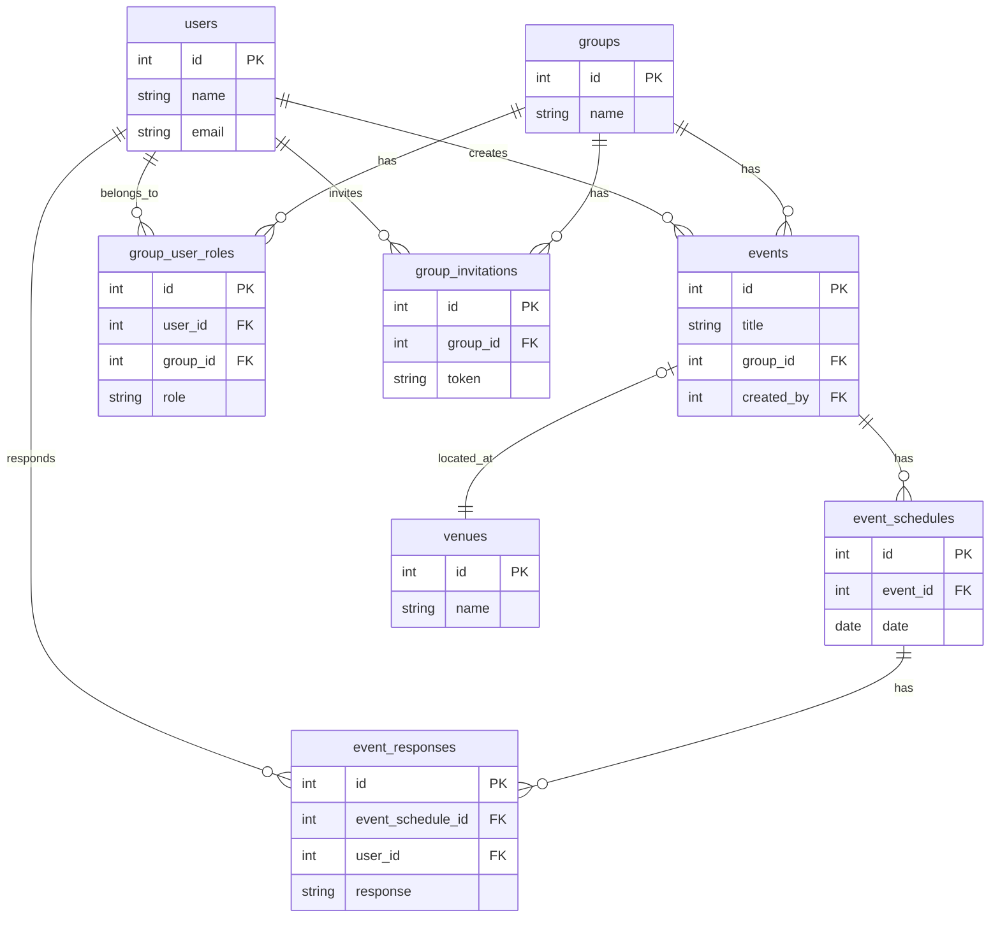

# canrit

URL: https://www.canrit.com/

## 概要

canritは、グループでのイベント日程調整を簡単にするWebアプリケーションです。

イベントを作成し、候補日程を設定すると、メンバーが参加可否を回答できます。各日程の回答状況が一覧で確認でき、最適な日程を素早く決定できます。

## 制作背景

### 複数人での日程調整の煩雑さを解消

飲み会や会議など複数人が参加するイベントでは、全員の都合を確認して日程を決めるのに時間がかかります。LINEやメールでやり取りすると、誰がいつ回答したか把握しづらく、調整が煩雑になりがちです。

このアプリでは、候補日程に対する全員の回答を一覧で確認できるため、最適な日程をスムーズに決定できます。

### グループ単位でのイベント管理

サークルやチーム、友人グループなど、同じメンバーで繰り返しイベントを開催することがあります。グループ機能により、メンバーを毎回招待する手間なく、継続的にイベントを管理できます。

## 使用技術

### バックエンド
- PHP 8.2
- Laravel 12
- MySQL 8.0

### フロントエンド
- Vue.js 3
- Tailwind CSS 3
- Vite

### インフラ
- Docker / docker-compose
- AWS (ECS, Fargate)
- Nginx

### その他
- Laravel Breeze（認証）
- spatie/laravel-permission（権限管理）

## 機能一覧

### ユーザー機能
- ユーザー登録・ログイン
- プロフィール画像の設定
- ユーザー情報の編集

### グループ機能
- グループの作成・編集
- 招待リンクの発行
- メンバーの管理（管理者/メンバー）
- グループアイコンの設定

### イベント機能
- イベントの作成・編集・削除
- 候補日程の設定（複数可）
- 開催場所の設定

### 日程回答機能
- 各候補日程への回答（参加可/微妙/不可）
- 回答状況の一覧表示
- リアルタイムな集計

## ER図

## ユーザーの声

> 「サークルの飲み会調整に使っています。LINEで何度もやり取りしていた頃と比べて、誰がいつ空いているか一目でわかるので助かっています。」（20代・学生）

> 「プロジェクトの定例会議の日程調整に活用。招待リンクを共有するだけでメンバーを追加できるのが手軽で良いです。UIがもう少し洗練されると嬉しいですが、機能面では十分満足しています。」（30代・会社員）

> 「友人との旅行計画で使いました。回答が3択なのがシンプルでわかりやすい。ただ、過去のイベントを検索する機能があるとさらに便利だと思います。」（20代・会社員）

## 今後の展望

- UI/UXの改良
- タグ機能の追加
- イベント検索機能の実装
